<!--
**sharvi2311/sharvi2311** is a ✨ _special_ ✨ repository because its `README.md` (this file) appears on your GitHub profile.

Here are some ideas to get you started:

- 🔭 I’m currently working on ...
- 🌱 I’m currently learning ...
- 👯 I’m looking to collaborate on ...
- 🤔 I’m looking for help with ...
- 💬 Ask me about ...
- 📫 How to reach me: ...
- 😄 Pronouns: ...
- ⚡ Fun fact: ...
-->

---

# 🌸 About Me

Hi! I'm **Sharvi** 👋

I'm a developer and cybersecurity enthusiast focused on building secure applications, exploring cutting-edge AI architectures, and understanding advanced computing paradigms.

- 🔒 **Focus:** Cybersecurity, Application Security & Secure System Design
- 🤖 **Interests:** NLP & Transformer Networks, Quantum Computing & Cryptography, Ethical Hacking &Penetration Testing
- 🌱 **Currently Learning:** 
  - **Security:** OWASP Top 10 & Web Application Penetration Testing
  - **AI / ML:** Transformer Architectures & Attention Mechanisms
  - **Core Systems:** Linux Systems Administration & Advanced Bash Scripting
  - **Languages:** C++, Python
- ⚙️ **Currently Working On:** Yutori - A personalized to-do organizer for students
- 🚀 **Goals:** Developing custom security analysis tools, building privacy-focused applications, 

---

## 🛠️ Languages & Tools

### 💻 Core Stack

  

### 🛡️ Security & Environment 

### ⚛️ AI & Quantum Exploration

---

## 📊 Activity & Statistics

  
  

  

---

## 💌 Connect With Me

## 🐍 Contribution Snake

  
  

 

engineered in code, directed in daydreams

